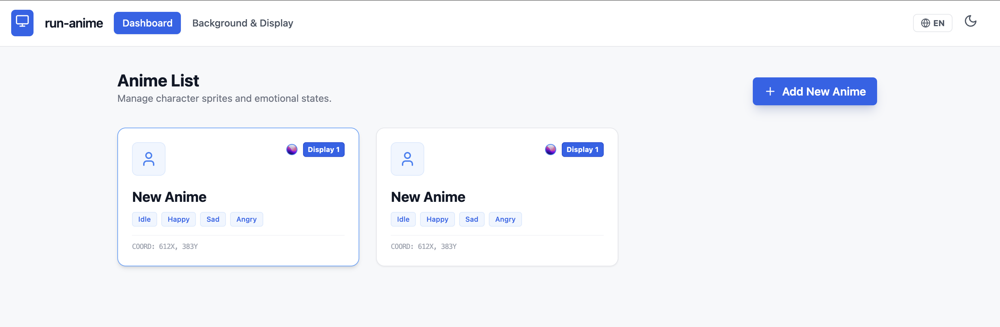
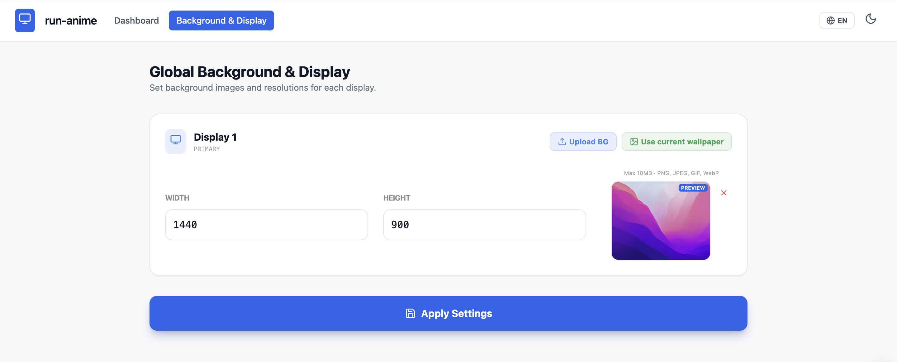
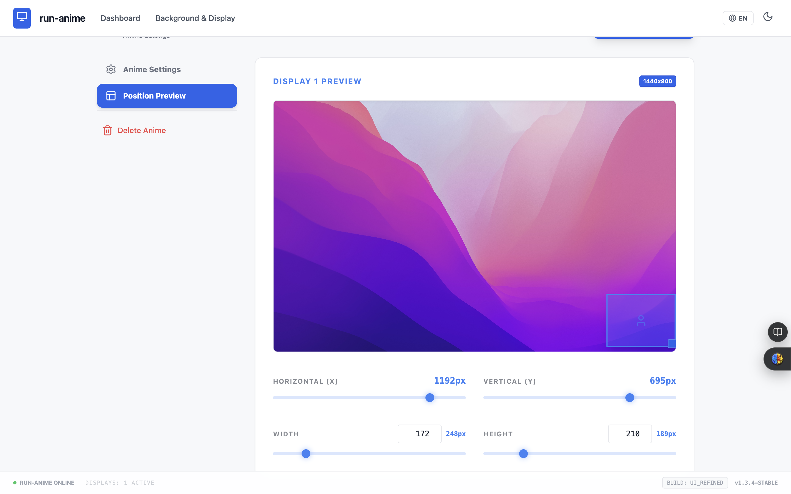
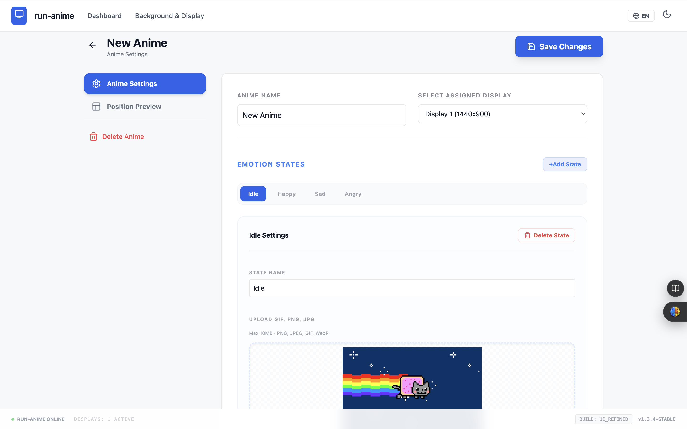

# run-anime

데스크톱 배경화면 위에 스프라이트(GIF/PNG) 애니메이션을 띄우고, 웹 UI로 설정을 관리하는 Go 앱입니다.

- **anime**: 캐릭터 한 단위
- **state**: 감정별 설정(스프라이트 이미지, 채팅 문구)

---

## 스크린샷

### GIF가 실행되는 배경화면

### 대시보드

### 디스플레이 설정

### Anime position (위치/크기)

### Anime setting (캐릭터 설정)

---

## 실행 방법

**개발 실행** (프론트 빌드 후 서버·오버레이 동시 실행)

- macOS/Linux: `./scripts/dev.sh` 또는 `bash scripts/dev.sh`
- Windows: `.\scripts\dev.ps1` (PowerShell)

**배포용 빌드** (실행 파일만 생성)

- macOS/Linux: `./scripts/build.sh` → 루트에 `runanime` 생성
- Windows: `.\scripts\build.ps1` → 루트에 `runanime.exe` 생성

실행 시 프로젝트 루트에 `web/` 폴더가 있어야 웹 UI가 동작합니다.

---

## 구현된 기능

- 웹 설정 UI: 모니터(해상도, 배경 이미지), 캐릭터(anime) 추가/편집
- 상태(State)별 스프라이트(GIF/PNG) 업로드 및 오버레이에서 프레임 재생
- 캐릭터 위치·크기(Anime position), 모니터별 배치
- 데스크톱 오버레이(Ebiten)로 배경화면 위에 애니 표시
- 설정 저장(OS 설정 디렉터리), 다크 모드, 다국어(ko/en)

---

## 미구현 기능

- **감정 연동**: 게임/채팅 등 외부 이벤트에 따라 State(감정)를 자동 전환하는 연동 없음. 수동 설정만 가능.
- **LLM 연결**: 채팅 문구는 설정에 저장된 문자열만 사용. LLM/API로 대화 생성 기능 없음.
